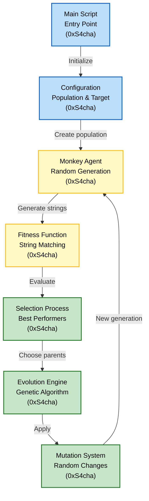
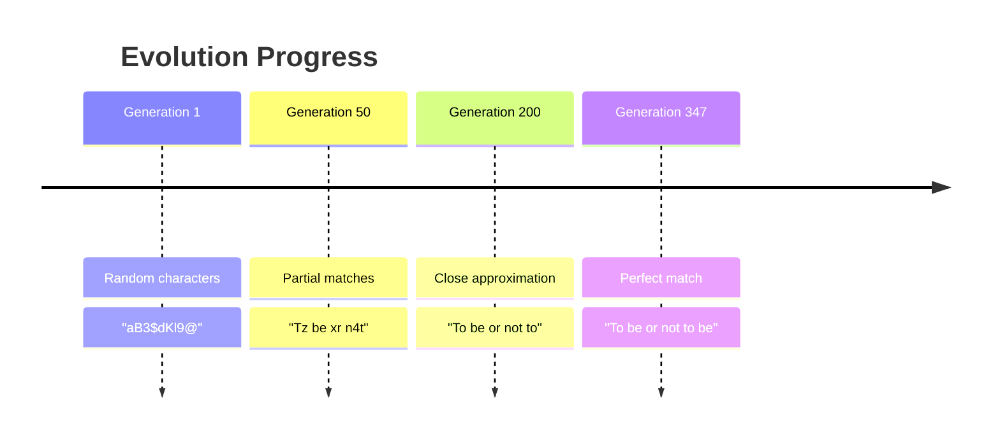

# Shakespeare-Monkey

Infinite Monkey Theorem simulation in Lua

## Authors

- [@0xS4cha](https://github.com/0xS4cha)


## Description

This project is a Lua implementation exploring the **Infinite Monkey Theorem** — the idea that a monkey randomly hitting keys on a typewriter for an infinite amount of time will eventually produce any given text, such as the complete works of Shakespeare.

The simulation demonstrates evolutionary algorithms and genetic optimization through a population of "monkey agents" that progressively improve their output to match a target string.



## Installation

This project requires Lua to be installed on your system.

### Prerequisites

```bash
# On macOS
brew install lua

# On Ubuntu/Debian
sudo apt-get install lua5.3

# On Windows
# Download from https://www.lua.org/download.html
```

## Usage

### Command Line

Run the simulation:

```bash
lua main.lua
```

### Customization

Edit the configuration in `main.lua` to adjust simulation parameters:

```lua
-- Population size
local population_size = 200

-- Target string to evolve
local target = "To be or not to be"

-- Mutation rate (0.0 to 1.0)
local mutation_rate = 0.01

-- Maximum generations
local max_generations = 10000
```

## Algorithm

### Genetic Evolution

The project implements a genetic algorithm with the following steps:

1. **Initialization**: Create a random population of monkey agents
2. **Fitness Evaluation**: Calculate how close each agent's string is to the target
3. **Selection**: Choose the best-performing agents as parents
4. **Crossover**: Combine parent genes to create offspring
5. **Mutation**: Randomly change characters to introduce variation
6. **Iteration**: Repeat until the target string is achieved

### Key Concepts

- **Chromosome**: A string of characters representing one monkey's output
- **Fitness Function**: Measures similarity to target string (character-by-character comparison)
- **Mutation Rate**: Probability of random character changes per generation
- **Selection Pressure**: Favors agents with higher fitness scores
- **Convergence**: Population gradually evolves toward the target



## Project Structure

```
│  main.lua      # Main simulation loop
│  agent.lua     # Monkey agent implementation
└  LICENSE       # MIT License
```

## Infinite Monkey Theorem

The **Infinite Monkey Theorem** states that:
> A monkey hitting keys at random on a typewriter keyboard for an infinite amount of time will almost surely type any given text, including the complete works of William Shakespeare.

### Practical Demonstration

This simulation demonstrates:
- ✅ **Evolution converges** much faster than pure random chance
- ✅ **Fitness-guided selection** dramatically reduces required iterations
- ✅ **Small populations** can solve the problem in reasonable time

### Mathematical Context

For a random monkey to type "To be or not to be":
- **26 letters + space** = 27 possible characters
- **18 characters long** = 27^18 ≈ 2.28 × 10^25 possible combinations
- **Pure random chance** would take astronomical time

With genetic algorithms:
- **Typical convergence**: 100-1000 generations
- **Population size**: 100-500 agents
- **Time**: Seconds to minutes

## Resources

- [Infinite Monkey Theorem](https://en.wikipedia.org/wiki/Infinite_monkey_theorem) — Mathematical background
- [Genetic Algorithms](https://en.wikipedia.org/wiki/Genetic_algorithm) — Optimization technique
- [Lua Programming](https://www.lua.org/) — Language documentation
- [The Genetic Algorithm](https://natureofcode.com/book/chapter-9-the-evolution-of-code/) — Nature of Code


## Disclaimer

⚠️ IMPORTANT — Educational use only:
- This project is for learning and demonstration purposes.
- Use this repository for study and reference only.

## Feedback

If you have feedback, open an issue or contact the author.
